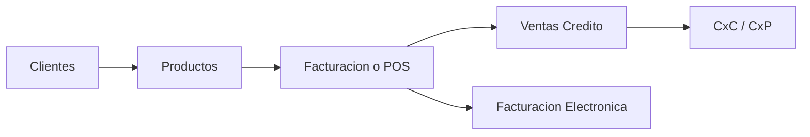
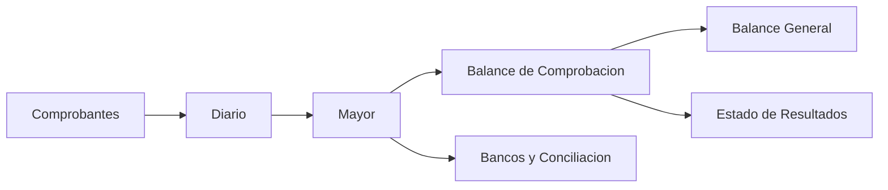
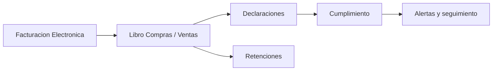

# Tutorial completo de modulos

## Objetivo
Este manual explica para que sirve cada modulo del sistema, cuando conviene usarlo, que datos necesita y que impacto genera en la operacion. Tambien incluye mapas visuales de proceso para capacitacion interna.

## Como usar este manual
1. Mira primero los mapas de proceso para entender el flujo general.
2. Revisa la seccion del area que vas a operar.
3. Usa la Guia Maestra del modulo `Tutorial` para abrir cada modulo directamente desde el sistema.

## Mapa comercial

## Mapa contable y cierre

## Mapa tributario

## Galeria visual referencial
- Dentro del modulo `Tutorial`, la pestana `Visuales` muestra paneles referenciales de las pantallas mas importantes.
- Esa galeria ayuda a explicar que mirar primero en modulos como Dashboard, Facturacion, Bancos, Conciliacion, Declaraciones, Facturacion Electronica y Nomina.
- Sirve para induccion, capacitacion interna y repasos rapidos antes de operar.

## Principal
### Dashboard
- Para que sirve: concentrar indicadores, alertas y accesos rapidos.
- Cuando abrirlo: al inicio del dia, antes del cierre y para priorizar trabajo.
- Necesita: que los demas modulos ya tengan informacion registrada.
- Genera: visibilidad ejecutiva y saltos rapidos a incidencias reales.
- Revisar: alertas tributarias, conciliaciones pendientes, planillas y vencimientos.

## Contabilidad
### Plan de Cuentas
- Para que sirve: definir la estructura contable del sistema.
- Cuando abrirlo: implementacion, ajustes del catalogo y nuevas operaciones.
- Necesita: criterio contable claro sobre activos, pasivos, patrimonio, ingresos y gastos.
- Genera: base para comprobantes, bancos, ventas, compras, nomina y reportes.
- Revisar: codigo, naturaleza, jerarquia y cuentas duplicadas.

### Comprobantes
- Para que sirve: registrar asientos y comprobantes manuales con trazabilidad.
- Cuando abrirlo: ajustes, reclasificaciones, ingresos, egresos y traspasos que no nacen de otro modulo.
- Necesita: fecha, glosa, detalle debe/haber y cuentas correctas.
- Genera: comprobante formal y asiento auditable.
- Revisar: equilibrio debe/haber, soporte documental y estado del comprobante.

### Diario
- Para que sirve: ver todos los asientos en orden cronologico.
- Cuando abrirlo: revision diaria, seguimiento de ajustes y rastreo de origen.
- Necesita: asientos ya generados por procesos del sistema.
- Genera: lectura cronologica de la contabilidad.
- Revisar: duplicidades, borradores, glosas incompletas y reversiones.

### Mayor
- Para que sirve: analizar saldos y movimientos por cuenta.
- Cuando abrirlo: conciliacion, analisis de una cuenta o explicacion de variaciones.
- Necesita: cuenta contable y periodo.
- Genera: extracto por cuenta con saldo inicial, movimientos y saldo final.
- Revisar: saldos anormales y movimientos sin soporte.

### Balance de Comprobacion
- Para que sirve: validar el cuadre del sistema antes de estados financieros.
- Cuando abrirlo: pre-cierre mensual, auditoria o revision interna.
- Necesita: asientos del periodo.
- Genera: saldos deudores y acreedores por cuenta.
- Revisar: cuentas invertidas, sin movimiento o con comportamiento anormal.

### Balance General
- Para que sirve: mostrar la situacion financiera al cierre.
- Cuando abrirlo: reportes gerenciales, presentaciones o soporte bancario.
- Necesita: contabilidad revisada y conciliaciones razonables.
- Genera: foto financiera de activos, pasivos y patrimonio.
- Revisar: inventario contable, bancos conciliados y coherencia patrimonial.

### Estado de Resultados
- Para que sirve: medir utilidad o perdida del periodo.
- Cuando abrirlo: cierre mensual, control de rentabilidad y comite gerencial.
- Necesita: ingresos, costos y gastos correctamente registrados.
- Genera: lectura de margenes y desempeno del negocio.
- Revisar: ventas anuladas, costos faltantes y gastos extraordinarios.

## Operaciones
### Facturacion
- Para que sirve: emitir facturas y registrar ventas con impacto contable y tributario.
- Cuando abrirlo: cada vez que la empresa realiza una venta formal.
- Necesita: cliente, productos o servicios, precios, forma de pago y datos fiscales.
- Genera: factura, asiento de venta y base para cobranza.
- Revisar: stock, datos fiscales del cliente y estado del documento.

### Punto de Venta
- Para que sirve: vender rapido con ticket y cobro inmediato.
- Cuando abrirlo: ventas de mostrador o caja.
- Necesita: productos, medios de pago y cliente opcional.
- Genera: ticket, venta al contado y salida de stock.
- Revisar: caja diaria, stock y cliente fiscal cuando corresponda factura.

### Ventas Credito
- Para que sirve: controlar cartera, vencimientos y cobranzas.
- Cuando abrirlo: ventas con plazo o cobros parciales.
- Necesita: factura, cliente, condiciones de pago y vencimiento.
- Genera: saldo por cobrar e historial de cobranza.
- Revisar: mora, anticipos y saldo pendiente.

### Notas de Credito y Debito
- Para que sirve: corregir o complementar operaciones ya emitidas.
- Cuando abrirlo: devoluciones, descuentos posteriores o cargos adicionales.
- Necesita: documento origen, motivo e importes.
- Genera: ajuste comercial y tributario con rastro.
- Revisar: efecto en IVA, stock y cartera.

### Compras
- Para que sirve: registrar compras con impacto fiscal, contable y de inventario.
- Cuando abrirlo: al recibir facturas o adquisiciones del negocio.
- Necesita: proveedor, documento, items y clasificacion contable.
- Genera: compra, credito fiscal, cuenta por pagar y stock si aplica.
- Revisar: NIT del proveedor, impuestos y soporte.

### Proveedores
- Para que sirve: administrar terceros de compra y abastecimiento.
- Cuando abrirlo: altas, actualizaciones o revision de historial.
- Necesita: datos fiscales y comerciales del proveedor.
- Genera: maestro de proveedores usable por compras y pagos.
- Revisar: NIT, contactos, historial y saldos pendientes.

### Clientes
- Para que sirve: mantener limpia la base comercial para facturacion y cobranza.
- Cuando abrirlo: altas de clientes y revision de cartera.
- Necesita: razon social, identificacion fiscal y contacto.
- Genera: maestro de clientes.
- Revisar: datos fiscales correctos, duplicados y condiciones comerciales.

## Inventario y Activos
### Productos
- Para que sirve: centralizar la ficha maestra de productos y servicios.
- Cuando abrirlo: creacion, edicion de precios, costos o carga de imagen.
- Necesita: codigo, nombre, categoria, costo, precio e imagen opcional.
- Genera: item listo para ventas, POS e inventario.
- Revisar: codigo unico, stock minimo, costo, precio e imagen principal.

### Inventario
- Para que sirve: controlar existencias y valorizacion.
- Cuando abrirlo: revision de stock, entradas, salidas y alertas.
- Necesita: productos y movimientos operativos.
- Genera: visibilidad de stock y valuacion.
- Revisar: diferencias fisico/contable, stock bajo y costos desactualizados.

### Kardex
- Para que sirve: rastrear cada entrada y salida por producto.
- Cuando abrirlo: diferencias de stock o auditoria de inventario.
- Necesita: producto y periodo.
- Genera: secuencia detallada de movimientos.
- Revisar: referencias faltantes, saltos de stock y costos mal aplicados.

### Activos Fijos
- Para que sirve: controlar bienes, depreciacion y valor en libros.
- Cuando abrirlo: altas, bajas, depreciaciones y cierre patrimonial.
- Necesita: fecha de alta, costo, vida util y valor residual.
- Genera: ficha del activo y lectura patrimonial.
- Revisar: depreciacion acumulada, bajas no registradas y cuentas asociadas.

## Finanzas
### Bancos
- Para que sirve: centralizar cuentas y movimientos de tesoreria.
- Cuando abrirlo: alta de cuentas, registro o importacion de movimientos.
- Necesita: cuentas bancarias y relacion contable.
- Genera: saldos por cuenta y base para conciliacion y flujo.
- Revisar: origen del movimiento, tipo, duplicados y saldo.

### Conciliacion Bancaria
- Para que sirve: comparar banco contra libros y explicar diferencias.
- Cuando abrirlo: cierre mensual o al detectar diferencias de saldo.
- Necesita: cuenta, fecha de corte, extractos y asientos.
- Genera: partidas conciliadas, excepciones y ajustes propuestos.
- Revisar: diferencia final, partidas en transito y cargos bancarios no registrados.

### Flujo Caja
- Para que sirve: proyectar liquidez a partir de bancos, cartera y obligaciones.
- Cuando abrirlo: seguimiento semanal o prevision de faltantes.
- Necesita: bancos, cuentas por cobrar, cuentas por pagar y vencimientos.
- Genera: lectura de liquidez y escenarios de caja.
- Revisar: baches de liquidez y concentracion de vencimientos.

### CxC / CxP
- Para que sirve: consolidar cartera por cobrar y obligaciones por pagar.
- Cuando abrirlo: comites de cobranza o programacion de pagos.
- Necesita: facturas, pagos, compras, anticipos y terceros.
- Genera: ranking de vencidos e historial de cobros/pagos.
- Revisar: saldos vencidos, documentos sin aplicar y anticipos no compensados.

## Impuestos SIN
### Libro Compras / Ventas
- Para que sirve: preparar el libro fiscal del periodo.
- Cuando abrirlo: antes de exportar o presentar IVA.
- Necesita: ventas, compras y estados SIN del periodo.
- Genera: base exportable y alertas de incidencias fiscales.
- Revisar: ventas observadas, compras sin soporte y pendientes del periodo.

### Declaraciones
- Para que sirve: controlar vencimientos y registrar declaraciones por periodo.
- Cuando abrirlo: preparacion y presentacion de IVA, IT, IUE u otras obligaciones.
- Necesita: tipo de obligacion, periodo, monto y configuracion fiscal.
- Genera: registro de declaracion y estado presentada o pendiente.
- Revisar: duplicados, montos negativos y facturas electronicas rechazadas del mismo periodo.

### Cumplimiento Normativo
- Para que sirve: concentrar riesgos y vencimientos regulatorios.
- Cuando abrirlo: seguimiento tributario y control ejecutivo.
- Necesita: declaraciones, retenciones, nomina y configuracion tributaria.
- Genera: cola de cumplimiento y alertas priorizadas.
- Revisar: obligaciones vencidas y incidencias SIN abiertas.

### Retenciones
- Para que sirve: registrar y controlar retenciones fiscales.
- Cuando abrirlo: emision, seguimiento o presentacion de retenciones.
- Necesita: tercero, tipo, base imponible, monto y fecha.
- Genera: retencion con estado y soporte contable.
- Revisar: calculo, tipo correcto y estado de presentacion.

### Facturacion Electronica
- Para que sirve: revisar el estado SIN de las facturas y resolver incidencias.
- Cuando abrirlo: cuando hay observaciones, rechazos o revision de periodo fiscal.
- Necesita: factura emitida, datos fiscales, configuracion SIN y actividad economica.
- Genera: estado SIN, soportes y cola de incidencias.
- Revisar: NIT invalido, CUF/CUFD faltante y configuracion incompleta.

## Planificacion
### Presupuestos
- Para que sirve: comparar plan contra ejecucion.
- Cuando abrirlo: planeacion y seguimiento gerencial.
- Necesita: periodo, lineas y montos objetivo.
- Genera: lectura de desvio y control presupuestario.
- Revisar: sobreejecucion y presupuestos desactualizados.

### Centros de Costo
- Para que sirve: medir consumo y desempeno por area o unidad.
- Cuando abrirlo: control gerencial y analisis de costos.
- Necesita: centro definido, presupuesto, cuentas y responsable.
- Genera: ejecucion por area y lectura de desvio.
- Revisar: cuentas mal asociadas y responsables no definidos.

## Recursos Humanos
### Nomina
- Para que sirve: generar planillas, RC-IVA y pago de personal.
- Cuando abrirlo: cada cierre laboral mensual.
- Necesita: empleados, conceptos, periodo y facturas RC-IVA si aplica.
- Genera: planilla, detalle por empleado y asiento de pago.
- Revisar: netos, RC-IVA, duplicidad de periodos y estado de pago.

### Empleados
- Para que sirve: mantener el padron laboral del negocio.
- Cuando abrirlo: altas, bajas y actualizaciones.
- Necesita: datos personales, cargo y estado laboral.
- Genera: base para nomina y control organizacional.
- Revisar: datos incompletos o empleados inactivos aun usados en procesos.

## Reportes
### Reportes
- Para que sirve: centralizar salidas ejecutivas y operativas.
- Cuando abrirlo: cortes gerenciales o exportacion de informacion.
- Necesita: datos del periodo y filtros correctos.
- Genera: reportes descargables y resumenes.
- Revisar: coherencia del periodo y calidad de la base.

### Analisis Financiero
- Para que sirve: traducir la contabilidad a indicadores.
- Cuando abrirlo: comites gerenciales y revision de estrategia.
- Necesita: balances y resultados consistentes.
- Genera: ratios, tendencias e insumos para decision.
- Revisar: comparabilidad entre periodos y calidad del dato base.

### Analisis Inteligente
- Para que sirve: detectar hallazgos y patrones sobre datos persistidos.
- Cuando abrirlo: revision ejecutiva rapida o apoyo analitico.
- Necesita: datos suficientemente completos.
- Genera: sugerencias de revision y alertas interpretativas.
- Revisar: validar siempre el dato base antes de actuar.

### Rentabilidad
- Para que sirve: entender margen por producto, linea o unidad.
- Cuando abrirlo: revision comercial, pricing o eficiencia de costos.
- Necesita: ventas, costos y centros de costo.
- Genera: lectura de margenes y hallazgos de rentabilidad.
- Revisar: productos sin costo real o costos incompletos.

### Auditoria Avanzada
- Para que sirve: detectar excepciones, riesgos y anomalias.
- Cuando abrirlo: pre-cierre o auditoria interna.
- Necesita: datos transaccionales y contables ya persistidos.
- Genera: hallazgos priorizados y accion correctiva sugerida.
- Revisar: criticidad, modulo origen y reincidencias.

## Configuracion
### Configuracion
- Para que sirve: definir datos maestros de empresa, fiscalidad y SIN.
- Cuando abrirlo: al comenzar y cuando cambien parametros clave.
- Necesita: datos legales, fiscales y tecnicos de la empresa.
- Genera: base para facturacion, declaraciones y demas modulos.
- Revisar: NIT, actividad economica, codigo de sistema, sucursal y punto de venta.

### Backup
- Para que sirve: dar visibilidad al respaldo y continuidad operativa.
- Cuando abrirlo: revision periodica de seguridad y continuidad.
- Necesita: politica de respaldo y control interno.
- Genera: estado de respaldo y continuidad.
- Revisar: ultima ejecucion, frecuencia y evidencia.

### Tutorial
- Para que sirve: ayudar a usuarios nuevos o en reciclaje.
- Cuando abrirlo: implementacion, capacitacion o dudas de proceso.
- Necesita: necesidad de capacitacion y contexto del proceso.
- Genera: rutas, mapas, guia maestra y manual ampliado.
- Revisar: que el contenido siga alineado al sistema real.

## Administracion
### Panel Admin
- Para que sirve: revisar la salud global del producto.
- Cuando abrirlo: soporte, supervision y monitoreo interno.
- Necesita: rol administrador.
- Genera: KPIs administrativos.
- Revisar: actividad anomala, usuarios bloqueados y cuentas con problemas.

### Gestion Usuarios
- Para que sirve: administrar acceso, estado y consistencia de usuarios.
- Cuando abrirlo: altas, bajas, soporte o revision de permisos.
- Necesita: datos del usuario y rol requerido.
- Genera: usuario habilitado, corregido o bloqueado.
- Revisar: roles, duplicados y estado de acceso.

### Suscripciones
- Para que sirve: controlar planes y vigencias del SaaS.
- Cuando abrirlo: renovaciones o soporte comercial.
- Necesita: cuenta, plan y estado comercial.
- Genera: visibilidad de suscripcion.
- Revisar: vigencias, bloqueos por plan y desajustes comerciales.

### Pagos Bolivia
- Para que sirve: seguir pagos locales de clientes a nivel administrativo.
- Cuando abrirlo: soporte comercial y confirmacion de pagos.
- Necesita: referencia de pago y cuenta cliente.
- Genera: estado administrativo del pago.
- Revisar: pagos sin aplicar o referencias incompletas.

### Logs Actividad
- Para que sirve: rastrear acciones y eventos para soporte y auditoria.
- Cuando abrirlo: incidentes, revisiones o actividad sospechosa.
- Necesita: eventos registrados por la plataforma.
- Genera: historial trazable por usuario y accion.
- Revisar: eventos criticos y patrones fuera de lo normal.

## Recomendacion de capacitacion interna
1. Induccion general: Dashboard, Configuracion y Tutorial.
2. Equipo comercial: Clientes, Productos, Facturacion, POS y Ventas Credito.
3. Equipo contable: Comprobantes, Diario, Mayor, Balance de Comprobacion y estados financieros.
4. Equipo tributario: Facturacion Electronica, Libro C/V, Declaraciones y Cumplimiento.
5. Equipo financiero: Bancos, Conciliacion, Flujo Caja y CxC / CxP.
